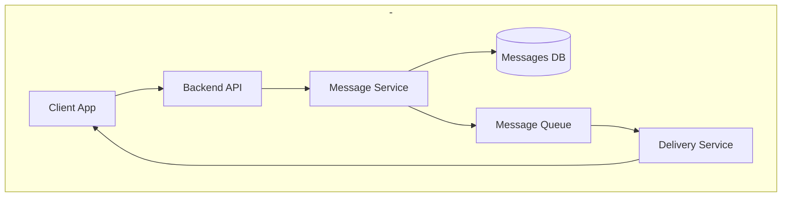
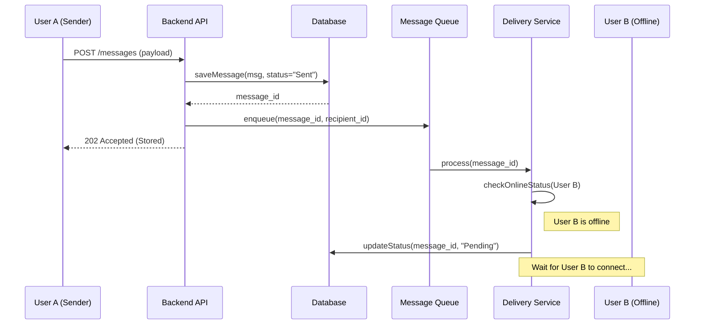
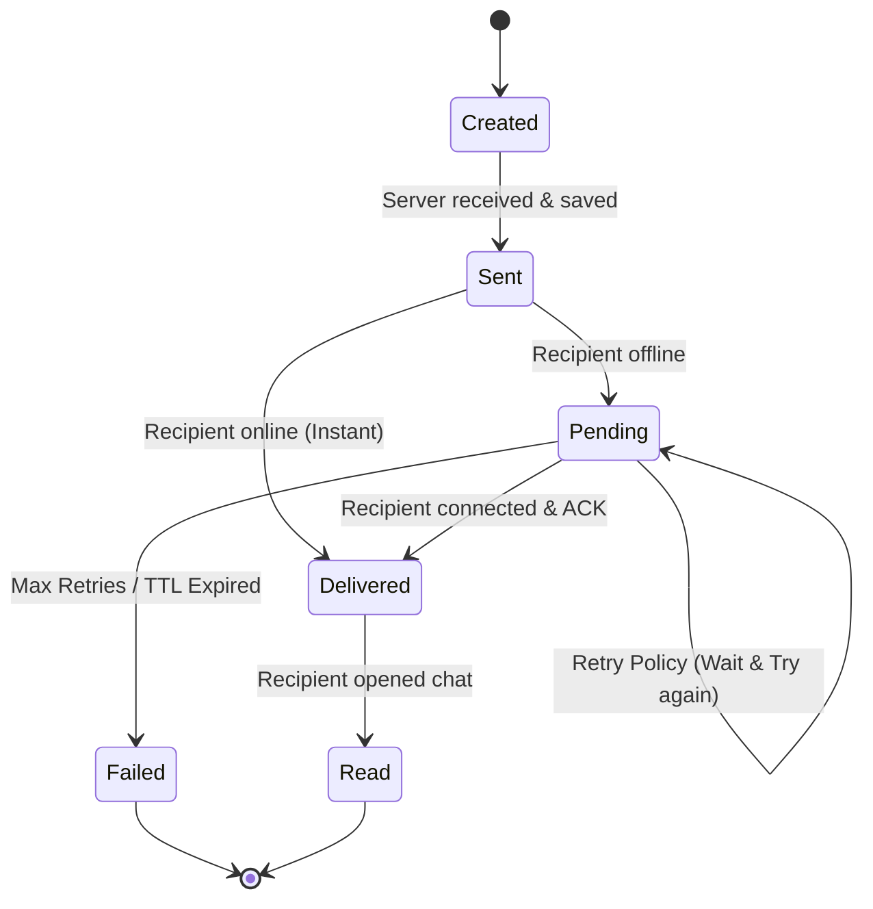

# Designing a Messaging System
## Offline Message Delivery
---
### Part 1 — Component Diagram
Here we show that the message first goes to the storage (Database) and then to the queue for asynchronous processing.

#### Description
- Client (Sender): Sends the message and receives the “Accepted” status.

- Backend API: Checks tokens and validates data.

- Message Service: The “brain” of the system. It is responsible for the logic: save to database -> put in queue.

- Database (PostgreSQL/MongoDB): Reliable storage. If the queue goes down, messages will remain here.

- Message Queue (RabbitMQ/Kafka): Ensures delivery. It holds the message until the Delivery Service can deliver it.

- Delivery Service (WebSocket/Push): Attempts to find an active connection to the recipient.
---
### Part 2 — Sequence Diagram
User A writes to User B, who is currently offline.

#### Process logic:

User A sends SendMessage.

- The API immediately saves the message in the DB with the status Sent.

- The API returns status 202 Accepted to User A. This is important: we don't say “delivered,” we say “we accepted it for processing.”

- Message Service puts the task in Queue.

- Delivery Service tries to find User B's session but gets Not Found.

- Delivery Service leaves the message in the queue or waits for the User_Connected event.

- When User B comes online, the service reads the queue and finally delivers the message.
---
### Part 3 — State Diagram

For offline delivery, the message lifecycle is longer because it can get “stuck” in a waiting state.
#### Description
- Created: The message is generated on the client.
- Sent: The message is successfully received by the server (stored in the database).
- Pending (Offline): The recipient is offline; the message is “live” in the queue or waiting for synchronization.
- Delivered: The message has been delivered to the recipient's device.
- Read: The recipient has opened the chat (final positive state).
- Failed: The message has not been delivered after a series of attempts (Retry limit reached).
---
### Part 4 — ADR (Architecture Decision Record)
#### Status: Accepted

####  Context:
In mobile and web messengers, both the sender and the recipient may have an unstable Internet connection or be offline for a long time.
The system must ensure that messages are not lost, even if the API is temporarily unavailable to the sender or the recipient is offline.

#### Solution:

* Client-Side Persistence: For the sender, implement a local queue on the device (Local Storage/SQLite). If the Backend API is unavailable, the message is stored locally and automatically sent when the connection is restored.

* Database-First on Server: Upon receiving a request, Message Service immediately stores the message in the Database before any further processing.

* Asynchronous Queueing: Use Message Queue to deliver to the recipient. If the recipient is offline, the message remains in Pending status and is processed according to the Retry Strategy (Exponential Backoff).

#### Alternatives:

* Direct In-memory Delivery (rejected): Risk of data loss during server reboot or brief network failure.

* Synchronous API Calls (rejected): The sender would be forced to wait for actual delivery to the recipient, which is impossible in offline conditions.

#### Consequences:

(+) Fault Tolerance: The system is resistant to communication failures at both ends of the chain.

(+) Guaranteed Delivery: The use of databases and queues ensures the “at-least-once delivery” principle.

(-) Latency: A slight delay in writing to the database, which is an acceptable compromise for reliability.
*** If the sender is offline, the message simply waits on their device. But our backend architecture is designed so that once a message has reached the API,
it is guaranteed to be stored in the database and delivered to the recipient as soon as they come online, thanks to the use of Message Queue and Retry Strategy.
